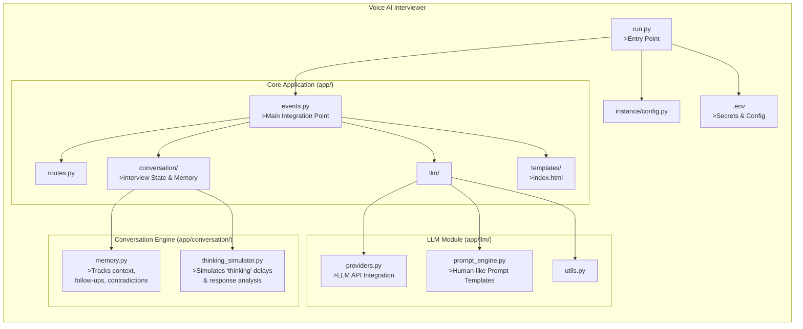

# Voice AI Interviewer
   The Voice AI Interviewer is an intelligent, voice-first application that simulates realistic job interviews using large language models (LLMs) and dynamic conversation management. Designed with a clean, modular architecture, it goes beyond simple Q&A by maintaining context, detecting inconsistencies, and generating thoughtful follow-up questions—just like a human interviewer would.

At its core, the system uses events.py as the main integration point, coordinating voice input/output, LLM responses, and real-time conversation logic. The new conversation/ module handles interview state, memory, and even simulates natural “thinking” pauses to create a more authentic experience. Meanwhile, prompt_engine.py provides carefully designed, human-like prompts that guide the AI toward engaging, relevant, and adaptive dialogue.

## Key Features of This Architecture:
### Event-driven core:
events.py coordinates real-time voice interaction.
### Stateful conversation:
Memory persists across turns to enable intelligent follow-ups.
### Pluggable LLMs:
providers.py abstracts model backends.
### Human-like pacing:
thinking_simulator.py adds natural delays.
### Full voice pipeline:
STT → LLM → TTS → user.
### Secure config: 
Secrets in .env, app config in instance/.


## 🚀 Local Project Setup

Follow the steps below to run the project locally:

### 1️⃣ Create a Virtual Environment
```bash
python -m venv .venv
```

### 2️⃣ Activate the Virtual Environment
```bash
.\.venv\Scripts\activate
```

### 3️⃣ Install Dependencies
```bash
pip install -r requirements.txt
```

### 4️⃣ Run the Application
```bash
python run.py
```

## Project Architecture Structure

## Ai-Voice-Interviewer
Ai Powered Voice Interview System 
      Certainly! Below is a realistic engineering architecture diagram in Mermaid format that reflects not just the file structure, but the runtime components, data flow, and system interactions of the Voice AI Interviewer—as it would operate in a production-like environment.

This version models:

### User interaction (voice input/output),
### Web server (Flask),
### Event-driven orchestration,
### LLM integration,
### Conversation state management,
### External services (e.g., speech-to-text, text-to-speech),
### Configuration and secrets.

```mermaid
flowchart TD
    subgraph "User"
        U[User\n(Voice Input)]
    end

    subgraph "Frontend"
        FE[index.html\n(JavaScript + WebRTC/\nMediaRecorder)]
    end

    subgraph "Backend (Flask App)"
        WS[Flask Web Server\n(run.py)]
        RT[routes.py\n(HTTP API Endpoints)]
        EV[events.py\n>Main Orchestrator\n(WebSocket / Async Events)]
    end

    subgraph "Conversation Engine"
        MEM[memory.py\n>Persistent Interview Context\n>Tracks contradictions,\n>follow-up logic]
        THINK[thinking_simulator.py\n>Simulates cognitive delay\n>Response planning]
    end

    subgraph "LLM Layer"
        PE[prompt_engine.py\n>Dynamic, human-like\n>interview prompts]
        PROV[providers.py\n>Abstracts LLM APIs\n(e.g., OpenAI, Anthropic)]
    end

    subgraph "External Services"
        STT[Speech-to-Text\n(e.g., Whisper, Google STT)]
        TTS[Text-to-Speech\n(e.g., ElevenLabs, Azure TTS)]
        LLM_API[(LLM Provider API\ne.g., OpenAI GPT-4)]
    end

    subgraph "Configuration & Secrets"
        ENV[.env\n>API Keys, Settings]
        CFG[instance/config.py\n>Flask Config]
    end

    %% Data Flow
    U -->|Voice Stream| FE
    FE -->|Audio Blob / WebSocket| RT
    RT --> EV

    EV -->|Request context| MEM
    MEM -->|Enriched history| EV

    EV -->|Trigger| THINK
    THINK -->|Delay + Intent| EV

    EV -->|Formatted input| PE
    PE -->|Structured prompt| PROV
    PROV -->|Call| LLM_API
    LLM_API -->|Response| PROV
    PROV -->|Parsed output| EV

    EV -->|Text response| TTS
    TTS -->|Audio stream| FE
    FE -->|Play audio| U

    EV -->|Transcribe audio| STT
    STT -->|Text transcript| EV

    WS --> CFG
    WS --> ENV

    classDef core fill:#4CAF50,stroke:#388E3C,color:white;
    classDef module fill:#2196F3,stroke:#0D47A1,color:white;
    classDef external fill:#FF9800,stroke:#E65100,color:white;
    classDef config fill:#9E9E9E,stroke:#616161,color:white;

    class EV,WS core
    class MEM,THINK,PE,PROV,RT module
    class STT,TTS,LLM_API external
    class ENV,CFG config
```

