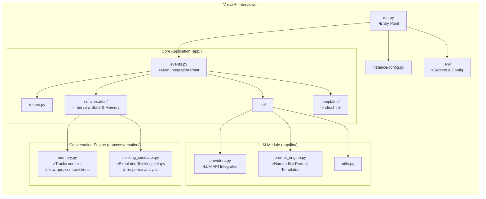
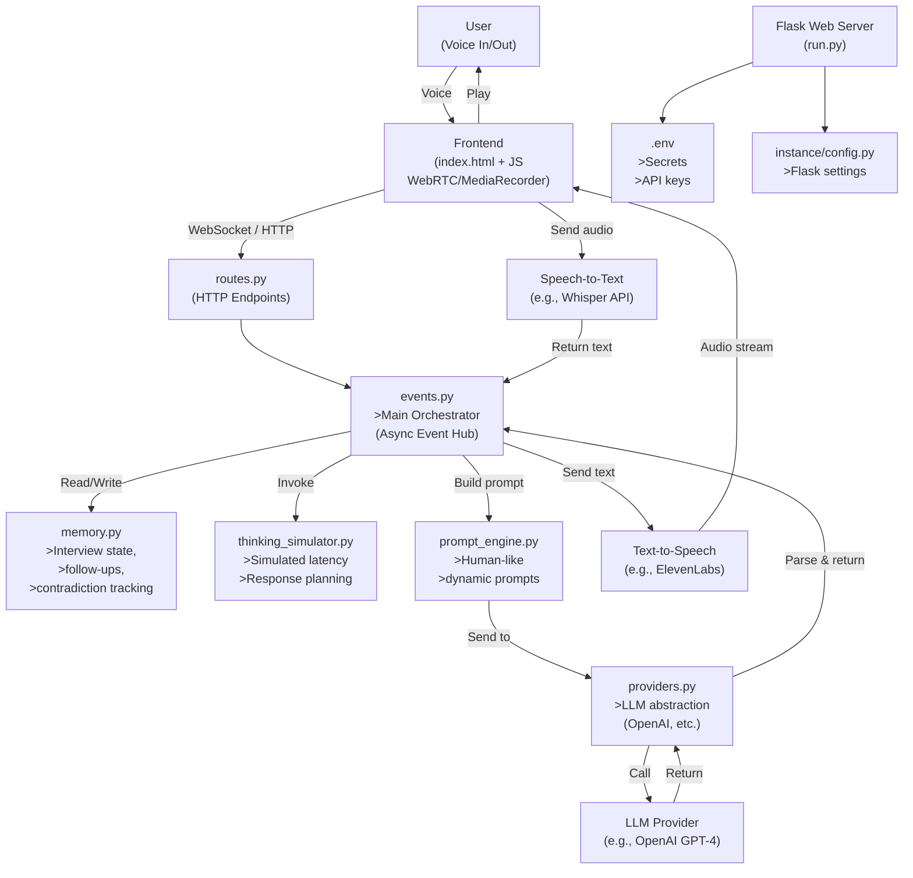

# Voice AI Interviewer
   The Voice AI Interviewer is an intelligent, voice-first application that simulates realistic job interviews using large language models (LLMs) and dynamic conversation management. Designed with a clean, modular architecture, it goes beyond simple Q&A by maintaining context, detecting inconsistencies, and generating thoughtful follow-up questions—just like a human interviewer would.

At its core, the system uses events.py as the main integration point, coordinating voice input/output, LLM responses, and real-time conversation logic. The new conversation/ module handles interview state, memory, and even simulates natural “thinking” pauses to create a more authentic experience. Meanwhile, prompt_engine.py provides carefully designed, human-like prompts that guide the AI toward engaging, relevant, and adaptive dialogue.


# 🚨 Things to Remember
###  1. Render.com Deployment (Test URL Only)
   https://ai-voice-interviewer-1.onrender.com/

The hosted URL on Render.com is meant only for testing purposes.

It may be slow and might not return accurate or real-time responses.

For the best performance and full functionality, use the local setup instead.

### 2. Local Testing Requirements

To ensure smooth testing and optimal results when running locally:

✅ Use a high-performance laptop or PC (fast CPU, enough RAM).

✅ Use a good-quality microphone for accurate voice input.

✅ Avoid background noise to improve speech recognition.


## Key Features of This Architecture:
### Event-driven core:
- events.py coordinates real-time voice interaction.
### Stateful conversation:
- Memory persists across turns to enable intelligent follow-ups.
### Pluggable LLMs:
- providers.py abstracts model backends.
### Human-like pacing:
- thinking_simulator.py adds natural delays.
### Full voice pipeline:
- User → STT → LLM → TTS → user
### Secure config: 
- Secrets in .env, app config in instance/.


## 🚀 Local Project Setup

Follow the steps below to run the project locally:

### 1️⃣ Create a Virtual Environment
```bash
python -m venv .venv
```

### 2️⃣ Activate the Virtual Environment
```bash
.\.venv\Scripts\activate
```

### 3️⃣ Install Dependencies
```bash
pip install -r requirements.txt
```

### 4️⃣ Run the Application
```bash
python run.py
```

## Project Architecture Structure

## Ai-Voice-Interviewer
Ai Powered Voice Interview System 
      Certainly! Below is a realistic engineering architecture diagram in Mermaid format that reflects not just the file structure, but the runtime components, data flow, and system interactions of the Voice AI Interviewer—as it would operate in a production-like environment.

This version models:

- User interaction (voice input/output),
- Web server (Flask),
- Event-driven orchestration,
- LLM integration,
- Conversation state management,
- External services (e.g., speech-to-text, text-to-speech),
- Configuration and secrets.



# Conclusion
      The Voice AI Interviewer delivers a realistic, voice-driven interview experience by combining dynamic conversation memory, human-like prompting, and simulated thinking behavior—all orchestrated through a clean, modular architecture. Built for extensibility and grounded in real engineering practices, it’s a practical step toward intelligent, empathetic AI interviewers.

