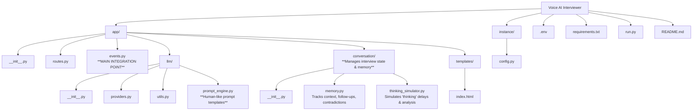
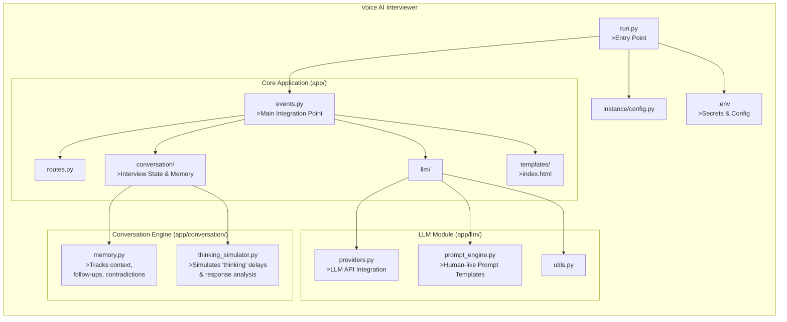

# Voice AI Interviewer
   The Voice AI Interviewer is an intelligent, voice-first application that simulates realistic job interviews using large language models (LLMs) and dynamic conversation management. Designed with a clean, modular architecture, it goes beyond simple Q&A by maintaining context, detecting inconsistencies, and generating thoughtful follow-up questions—just like a human interviewer would.

At its core, the system uses events.py as the main integration point, coordinating voice input/output, LLM responses, and real-time conversation logic. The new conversation/ module handles interview state, memory, and even simulates natural “thinking” pauses to create a more authentic experience. Meanwhile, prompt_engine.py provides carefully designed, human-like prompts that guide the AI toward engaging, relevant, and adaptive dialogue.

## Project Setup Locally
1. Create a virtual environment:
   python -m venv .venv
   .\.venv\Scripts\activate

2. Install dependencies:
   pip install -r requirements.txt

3. Run the app:
   python run.py

## Architecture Structure

=======
# Ai-Voice-Interviewer
Ai Powered Voice Interview System

